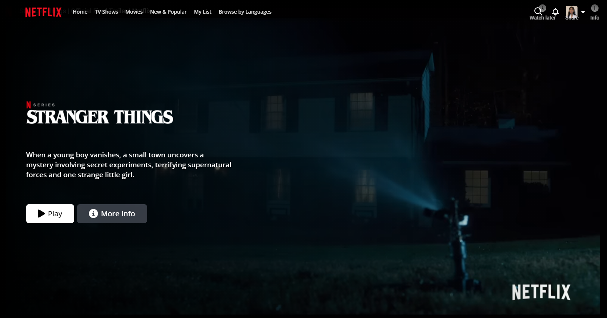
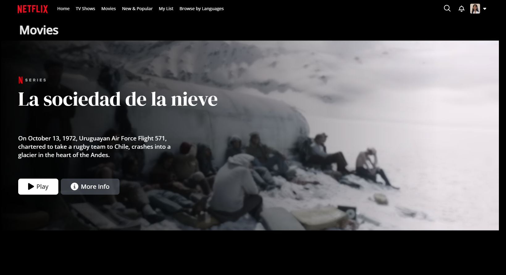
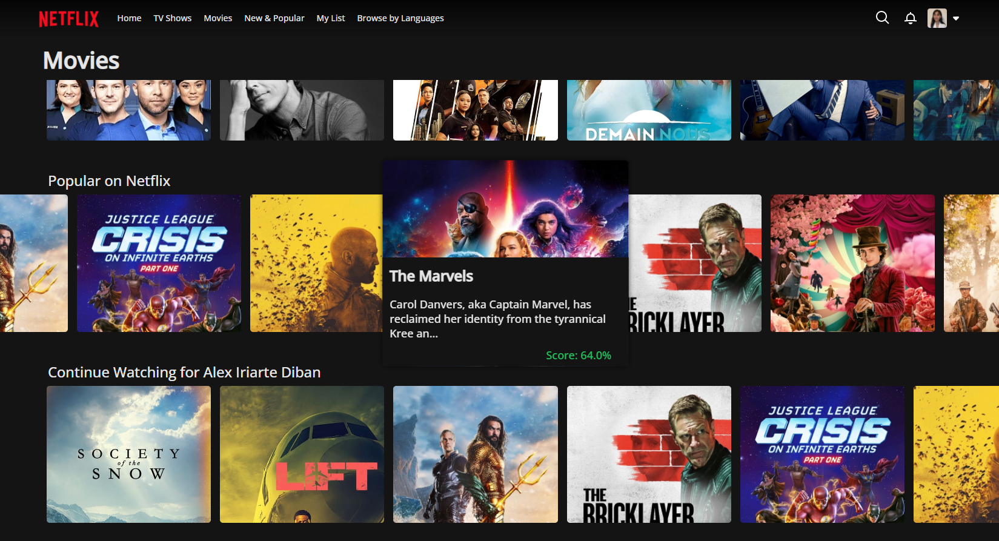

# Netflix Clone Frontend Project

Frontend project that replicates the Netflix interface. Visit deployed site [here](https://aneptuno.github.io/Netflix-Clone-Angular/) 
 !! This project is solely for educational purposes.

## Features
- **Angular 16.2.0** 
- **User Authentication (OAuth)** 
- **External API Integration for Movie Data** 
- **Dynamic Component Creation** 
- **Routing and Navigation** 
- **Tailwind CSS Styling** 
- **RxJs Library** 
- **Movie database implementation**.

## Screenshots

### **Home Page**

### **Movies Pages**

### **Responsive Design**

### **Browse Carrousel**

