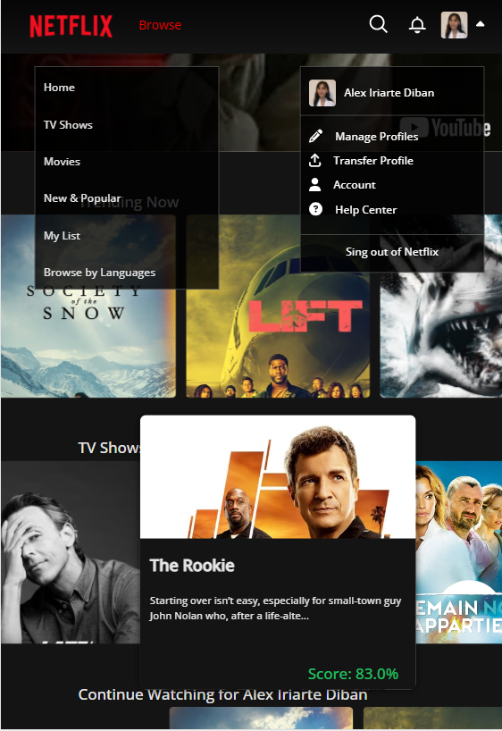

# Netflix Clone Frontend Project

A frontend project that replicates the Netflix interface. Visit the deployed site [here](https://netflix-clone-adiban.netlify.app/) 🌐🚀

## Features
- **Angular CLI version 16.2.0** 🅰️🔺
- **User Authentication (OAuth)** 🔒🔑
- **External API Integration for Movie Data** 🌐🍿
- **Dynamic Component Creation** 🔄🛠️
- **Routing and Navigation** 🗺️🚀
- **Tailwind CSS Styling** 🌈💨
- **RxJs Library** ⚛️🔄

## Screenshots

*Screenshot of the home page.*

*Screenshot of the views (movies).*

*Responsive design*

*Browse Carrousel*

